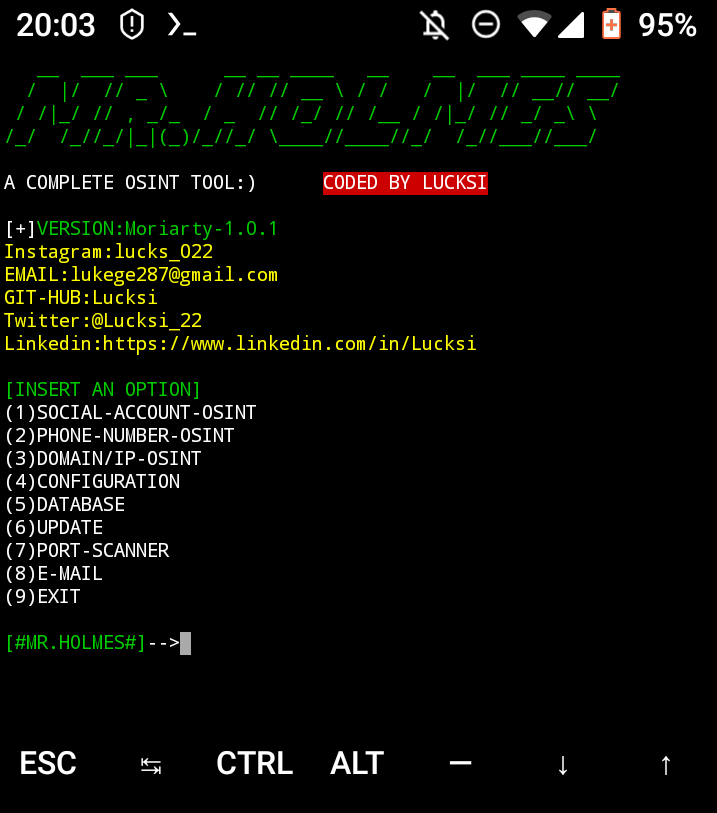
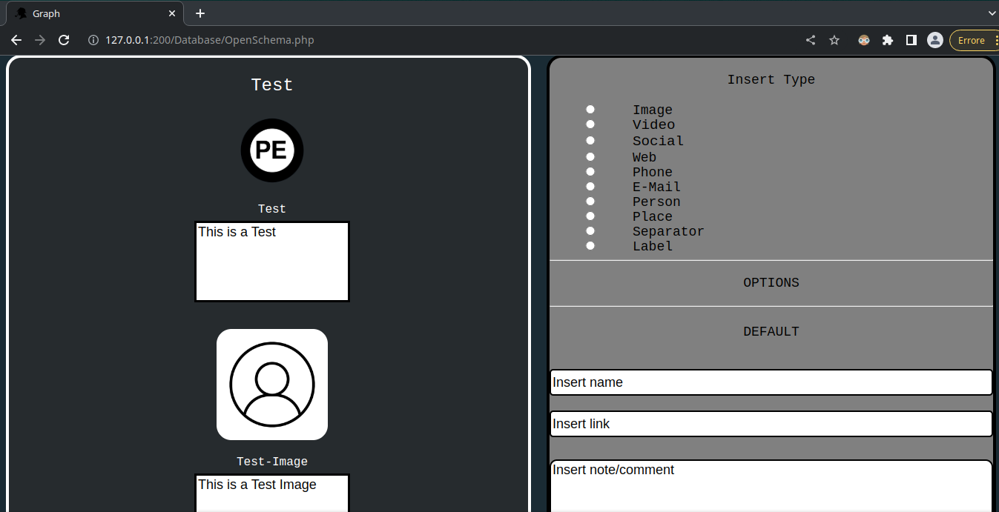
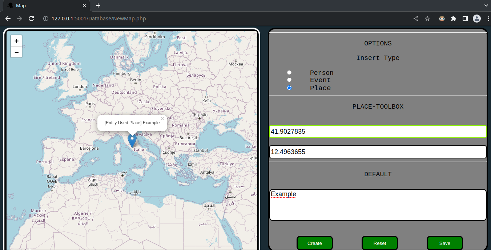
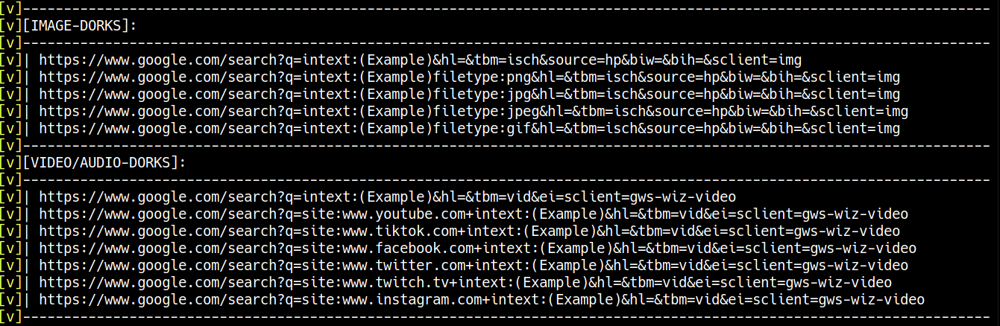
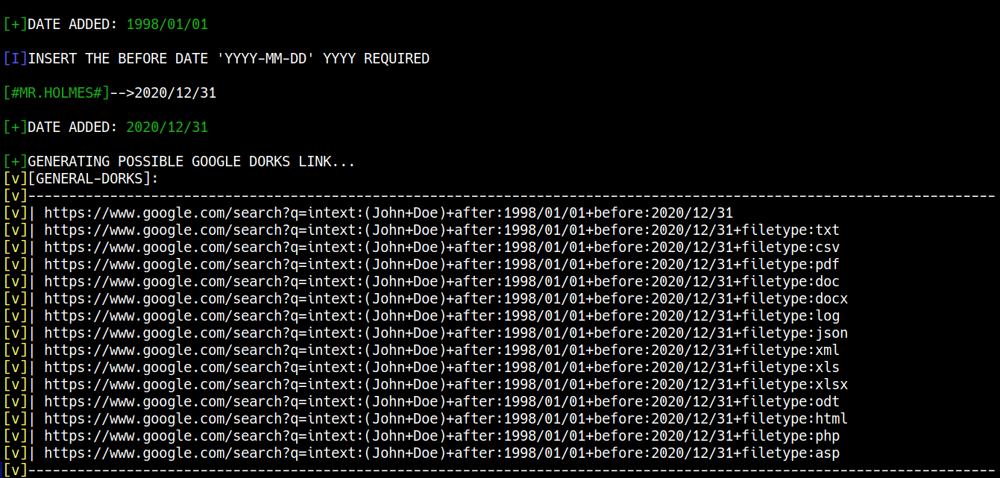
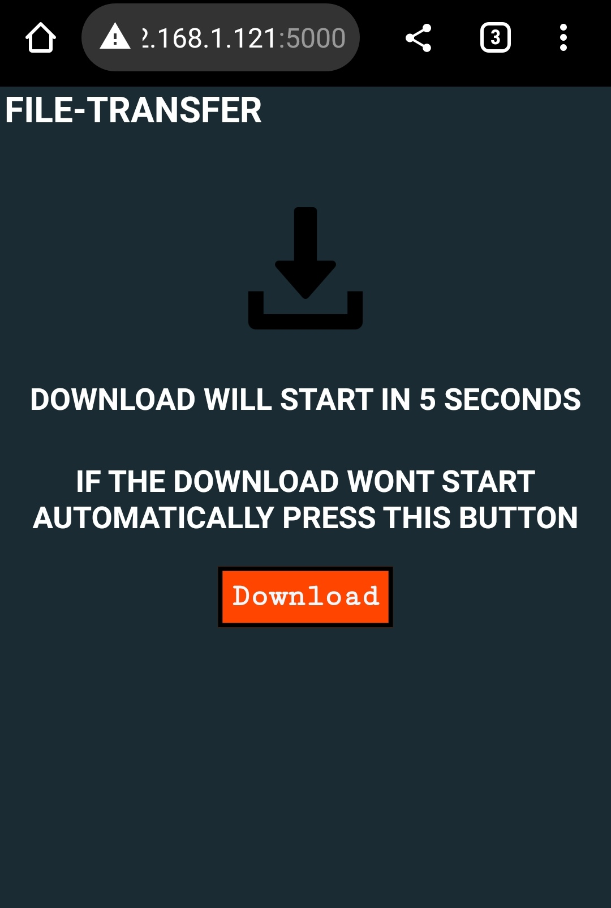
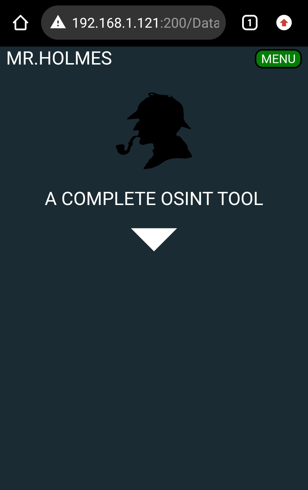
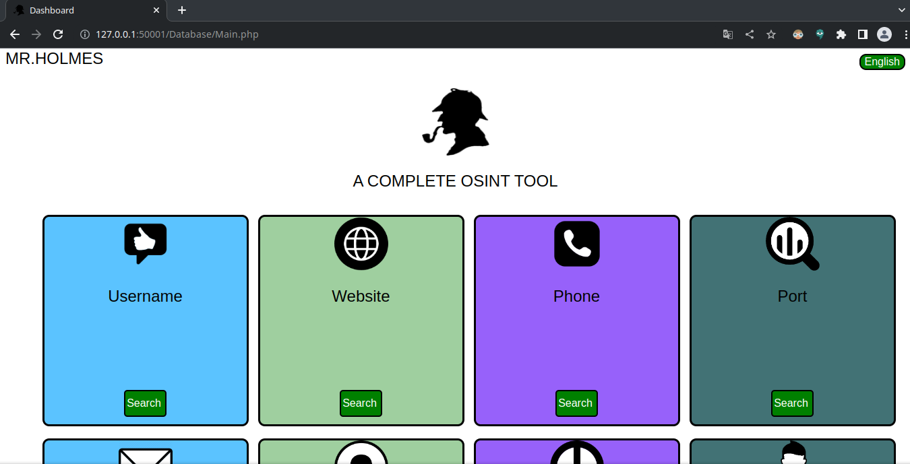
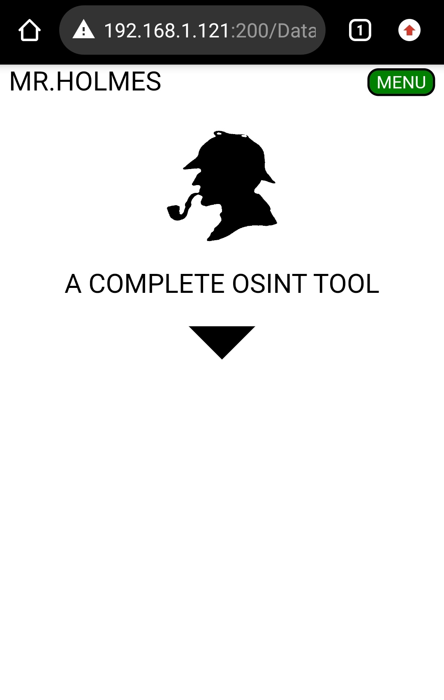
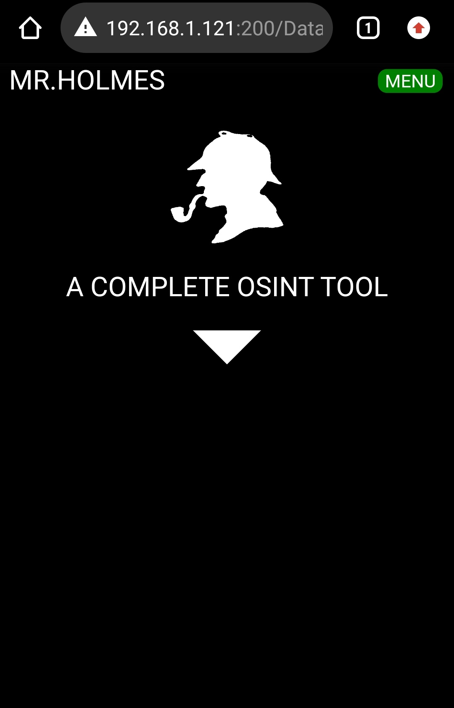

<p align="center">
  
</p>

<p align = "center">
  
  
  
  
  
  
  
</p>

# :mag: Mr.CodeHacker 

**Mr.CodeHacker est un outil de collecte d'informations (OSINT). Dont le but principal est d'obtenir des informations sur les domaines, les noms d'utilisateur, les e-mails et les numéros de téléphone à l'aide de ressources publiques disponibles sur le net, en utilisant également des techniques telles que Google / Yandex dorks pour des recherches encore plus spécifiques.certains proxies pour faire vos demandes anonyme et utilisez une API WhoIs pour obtenir plus d'informations sur un domaine.**
<br>

# :heavy_exclamation_mark: DISCLAIMER
**Cet Outil n'est pas précis à 100% Par conséquent, il est probable qu'il puisse parfois échouer. De plus, cet outil a été créé à des fins éducatives et de recherche uniquement Je n'assume aucune responsabilitè pour toute le utilisation incorrecte de cet outil.**
<br>

#  SCREENSHOT


<br>

<p align = "center">

</p>

<br>

# :heavy_check_mark: INSTALLATION LINUX/MAC:
```bash
git clone https://github.com/Lucksi/Mr.CodeHacker
cd Mr.CodeHacker
sudo apt-get update
sudo chmod +x install.sh
sudo bash install.sh
```
<br>

# :heavy_check_mark: INSTALLATION WINDOWS(1°WAY):
**Si git est installé sur votre ordinateur Windows, vous pouvez exécuter les commandes suivantes:**
```cmd
git clone https://github.com/Lucksi/Mr.CodeHacker
cd Mr.CodeHacker
Install.cmd
```
<br>

# :heavy_check_mark: INSTALLATION WINDOWS(2°WAY):
**Si vous téléchargez le fichier zip de Mr.CodeHacker, vous devez d'abord le décompresser, puis exécuter les commandes suivantes:**
```cmd
ren Mr.CodeHacker-master Mr.CodeHacker
cd Mr.CodeHacker
Install.cmd
```
<br>

# :heavy_check_mark: INSTALLATION TERMUX:
```bash
pkg install proot
git clone https://github.com/Lucksi/Mr.CodeHacker
cd Mr.CodeHacker
proot -0 chmod +x install_Termux.sh
./install_Termux.sh
```
<br>

#  UTILIZATION LINUX/MAC:
    sudo python3 MrCodeHacker.py
    OR:
    cd Launchers
    Execute Launcher.sh

<br>


#  UTILIZATION TERMUX:
    python3 MrCodeHacker.py

<br>

#  UTILIZATION WINDOWS:
    python MrCodeHacker.py
    OR:
    cd Launchers
    Execute Win_Launcher.exe

<br>

# API KEY LINK:
    https://whois.whoisxmlapi.com
<br>

# FILE DE CONFIGURATION:

    Configuration/Configuration.ini
<br>

# :heavy_exclamation_mark: ATTENTION
**DATABASE N'EST PAS DISPONIBILE SUR TERMUX.**
<br>

# :heavy_exclamation_mark: ATTENTION SUR WINDOWS
**SI PYTHON OU PHP NE S'INSTALLE PAS, VOUS DEVEZ LES INSTALLER MANUELLEMENT:**
    
<br>

# LISTE DES VERSIONS:
    https://lucksi.github.io/Mr.CodeHacker/Pages/versions.html
<br>

# :heavy_check_mark: GUI DARK/LIGHT MODE:
```bash
cd GUI
cd Theme
edit Mode.json
write:Light=(Light-Mode)
write:Dark=(Dark-Mode) 
write:High-Contrast(High-Contrast-Mode)
```
<br>

# Mode.json CODE EXAMPLE:
```json
{
    "Color": {
        "Background": "Light"
    }
}
```
<br>

# :heavy_check_mark: GUI/USERNAME/PASSWORD:
```bash
cd GUI
cd Credentials
edit Login.json
write:Status=Active/Deactive
edit Users.json
write:Username=Your Username
write:Password=Your Password
```
<br>

# Login.json CODE EXAMPLE:
```json    
{
    "Database": {
        "Status": "Active"
    }
}
```
<br>

# Users.json CODE EXAMPLE
```json
{
    "Users":[
        {
            "Username": "Your Username",
            "Password": "Your Password"
        }
    ]
}
```
<br>

# :heavy_check_mark: LANGUE RÉGLAGES:
```bash
cd GUI
cd Language
edit Language.json
```
<br>

# Language.json CODE EXAMPLE:
```json
{
    "Language": {
        "Preference": "English"
    }
}
```
<br>

# DEFAULT USERNAME AND PASSWORD:
    Username:Admin
    Password:Qwerty123

<br>

# LANGUES DISPONIBLES:
    Italiano 🇮🇹 
    English 🏴󠁧󠁢󠁥󠁮󠁧󠁿
    Français 🇫🇷
<br>

# VERSION ACTUELLE:
**T.G.D-1.0.4**

<br>

# CARTE INTERACTIVE FAITE AVEC:
**Leaflet: https://leafletjs.com**

<br>

# USERNAME ENTITIES:
**Les icônes sur le dossier GUI/Icon/Entities/Site_Icon proviennent de : https://www.iconfinder.com/ tout les crédit reviennent à leurs créateurs respectifs**

<br>

# ENCODING:
**Avec cette version il est possible de réaliser l'Encoding des Reports**

<br>

# DECODING:
**Avec cette version il est possible de réaliser le Decoding des Reports**

<br>

# HYPOTHESES
**Avec cette version, vous pouvez générer des "hypotheses" basees sur les informations collectees compris les hobby/interests possibles (les hypothèses peuvent ne pas être fiables à 100 %).**

<br>

# EMAIL-LOOKUP:
**Avec cette nouvelle version, il est possible de vérifier si un e-mail est connecté à certains réseaux sociaux/services spécifiques sans que le target le sache.**

<br>

# GRAPHS
**Avec cette nouvelle version a été ajoutée la possibilité de créer des graphiques a fin de créer un schéma pour planification des informations.**
# EXEMPLE



<br>

# CARTE:
**Cette nouvelle version a ajouté la possibilité de créer des cartes interactives.**

<br>

# EXEMPLE:



<br>

# DORKS:
**Avec cette nouvelle version a été ajoutée la possibilité de chercher Video/Sound/Images via Dorks (1) et effectuer des recherches spécifiques en saisissant une date ex '1998/01/1' ou une plage de dates par ex '1998/01/01-2020/12/31' (2).**

<br>

# EXAMPLE (1):



<br>

# EXAMPLE (2):



<br>

# PDF:
**Avec cette nouvelle version a été ajoutée la possibilité de convertir vos graphiques en PDF.**

<br>

# EXAMPLE:

<p align = "center">

</p>

<br>

# THEMES PDF DISPONIBLES:
    Light 🌕
    Dark 🌗
    High-Contrast 🌗

<br>

# FILE-TRANSFER:
**Avec cette version, il est possible de transferer vos rapports directement sur votre telephone via Qr-Code.**

<br>

# FILE-TRANSFER PAGE:

<p align = "center">

</p>

<br>

# :last_quarter_moon: DARK MODE:


<br>

<p align = "center">

</p>

<br>

# :full_moon: LIGHT MODE:


<br>

<p align = "center">

</p>


<br>

# :last_quarter_moon: HIGH-CONTRAST MODE:


<br>

<p align = "center">

</p>

<hr>
<br>

## <p align = center> STARGAZERS OVER TIME 


[](https://starchart.cc/Lucksi/Mr.CodeHacker)

<br>

## <p align= center>CREER AVEC :heart: PAR LUCKSI IN :it:</p>

## <p align = center>CRÉATEUR ORIGINAL: <a href = "https://github.com/Lucksi">LUCA GAROFALO (Lucksi)</a></p>


## <p align = center>LICENCE: GPL-3.0 License <br>COPYRIGHT: (C) 2021-2024 Lucksi
